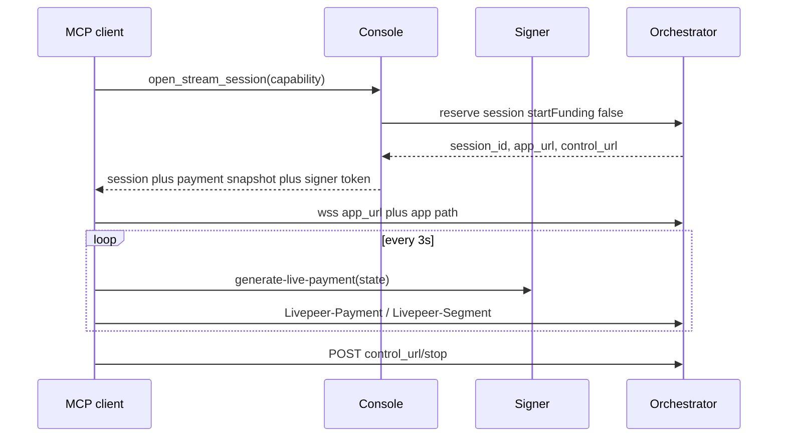

# Stream session handoff (spike)

Reserve in Console, then hand the session and payment state to the client. The
client drives the WebSocket (or trickle) and the 3-second funding loop. This
document is the spike deliverable: **do not add a production MCP tool** until
the decision gate below is closed.

## Why `run_capability` cannot stream

`runInference` for a persistent runner is `reserve → one HTTP call → stop`.
The Vercel isolate cannot hold a `RunnerSession` across MCP tool calls (same
reason the isolate job map was dropped). MCP also has no socket to the caller.
Streaming therefore has to leave the isolate.



## SDK pieces (landed in this package)

- `reserveSession({ startFunding: false })` — pays the 402, does **not** start
  `runPayments` in the reserving process.
- `RunnerSession.paymentSession` — the live `LivePaymentSession` after reserve.
- `LivePaymentSession.snapshot()` / `fromSnapshot()` — serialize `type`,
  `challenge` (`paymentParams`, `manifestId`, `paymentUrl`), `app`, `maxPrice`,
  and `state`.

The client builds `wss://` from `app_url` the same way
`example-apps/realtime-transcription/client.py` does. This package still has
no WebSocket client.

Envelope the MCP tool would return (not implemented):

```json
{
  "session_id": "…",
  "app_url": "https://orch/…/app",
  "control_url": "https://orch/…/control/…",
  "endpoint": "/transcribe",
  "payment": {
    "type": "live",
    "challenge": {
      "paymentParams": "…",
      "manifestId": "…",
      "paymentUrl": "https://orch/…/pay"
    },
    "app": "livepeer-example/realtime-transcription",
    "maxPrice": { "price": 0.1, "currency": "usd", "unit": "hour" },
    "state": { "n": 1 }
  },
  "signer_url": "https://signer…",
  "signer_token": "eyJ…",
  "expires_in": 300
}
```

`handoff_client.py` in `example-apps/realtime-transcription` consumes this
file and streams.

## Decision gate — do not ship until both answers are yes

### 1. Credential scoping: **no, not today**

The handoff gives the client a signer JWT that can call
`/generate-live-payment`. PymtHouse mints that JWT as **app + external user**
with scope `sign:job` (`mintUserSignerToken` /
`app-scoped-signer-token-exchange`). TTL is `SIGNER_JWT_TTL_SECONDS` (300s).

There is **no** JWT claim for `manifest_id`, runner `app`, or `maxPrice`.
The remote-signer webhook authorizes `sign:job` and stops there
(`src/app/webhooks/remote-signer`). `maxPrice` is a **request body** field the
client sends; a malicious holder can omit or raise it.

Unscoped, the client can mint payments for **any** job under that user/app
until the token expires. This architecture must not ship until PymtHouse can
issue a credential bound to one `manifest_id` (and ideally one `app` + a
price ceiling the signer enforces).

### 2. Spend enforcement after handoff: **partial, not enough**

`run_capability` gates on `assertSpendable(await fetchMcpUsage(principal))`
once, before dispatch. After handoff that gate no longer runs.

The signer has a **balance** gate (`signer-balance-gate.ts`) that can 483
mid-stream when hosted billing / trial credits are exhausted. That is
account-wide, not per session. There is no max session duration, no
per-manifest cap, and no revocation of an already-minted `sign:job` JWT short
of expiry.

A shippable handoff needs at least one of: a session-scoped JWT, a signer-side
`maxPrice` claim, a hard duration, or Console-side revocation of the funding
credential.

## Refresh

A stream will outlive 300s. The client already holds an MCP OAuth bearer and
can re-exchange it the same way Console does
(`exchangeMcpSignerSession`). Until the JWT is session-scoped, each refresh
re-issues the same unscoped `sign:job` power.

## Out of scope

Trickle (`echo`, likely `streamdiffusion`) is a different protocol from
WebSocket. The envelope can still reserve + fund; the media path is separate.
